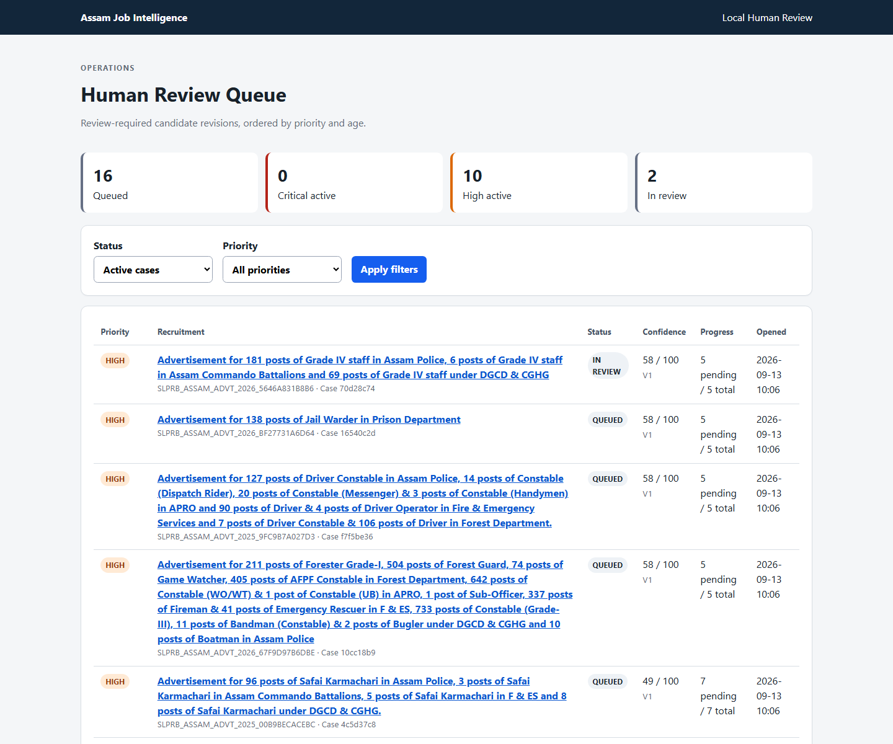
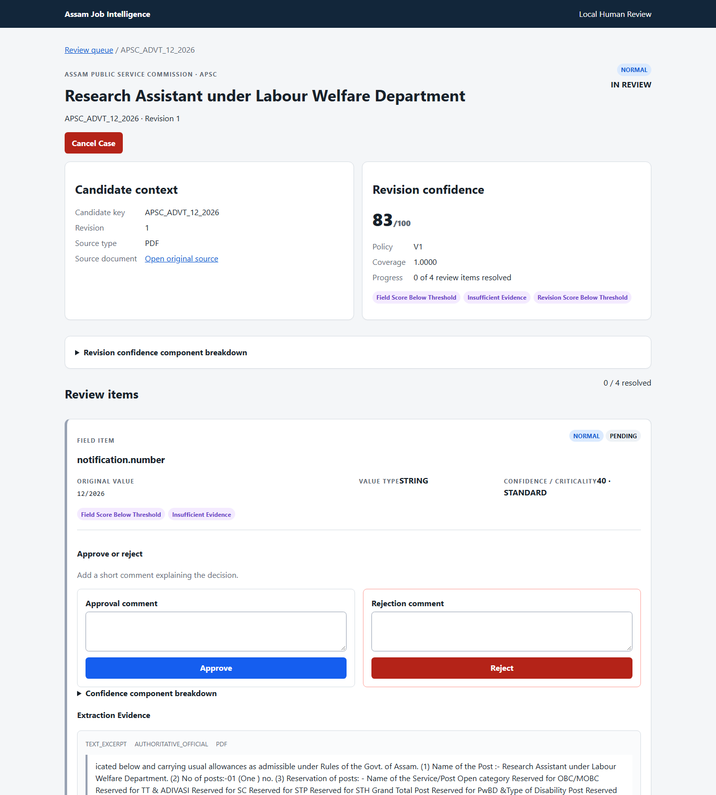
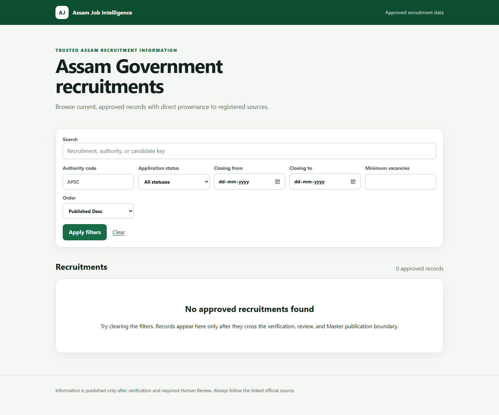
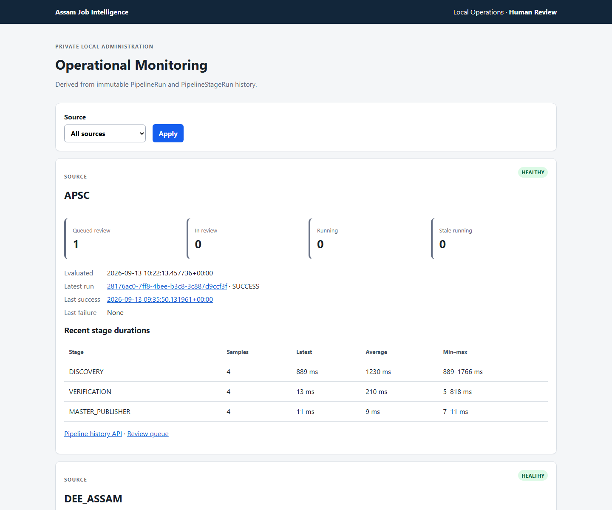

# Complete Local Operations Runbook

This guide starts Assam Job Intelligence from an empty local setup, ingests registered official
sources, runs Verification and Confidence, completes Human Review when required, and publishes
eligible approved data into Recruitment Master. Commands use PowerShell from the repository root.

The trust boundary is mandatory:

```text
official source -> Discovery -> Candidate + Evidence -> Verification -> Confidence
  -> Human Review when required -> Master Publisher -> /jobs
```

Discovery, Verification, or a confidence number alone never publishes a recruitment.

## 1. Prerequisites

- Windows with Docker Desktop running
- Python 3.12 managed through `uv`
- PostgreSQL container from this repository
- PowerShell opened in `D:\ASSAM_JOB_INTEL`

Create local configuration once:

```powershell
Copy-Item .env.example .env
uv sync
```

Do not commit `.env`, database passwords, GitHub tokens, or other secrets.

## 2. Start PostgreSQL and apply the schema

```powershell
docker compose up -d postgres
docker compose ps
uv run alembic upgrade head
uv run alembic current
uv run alembic check
```

Expected migration head at the time of this guide:

```text
20260912_0011 (head)
No new upgrade operations detected.
```

Check application health without starting the browser application:

```powershell
uv run python -c "from app.db.session import SessionLocal; s=SessionLocal(); print(s.connection().exec_driver_sql('select 1').scalar()); s.close()"
```

## 3. Start the complete private/debug application

```powershell
$env:AJI_DEBUG = "true"
uv run uvicorn app.main:app --reload --host 127.0.0.1 --port 8000
```

Open these local-only pages:

- Human Review: `http://127.0.0.1:8000/review`
- Operational monitoring: `http://127.0.0.1:8000/operations`
- Internal API documentation: `http://127.0.0.1:8000/docs`
- Public job portal preview: `http://127.0.0.1:8000/jobs`

`app.main` contains private administration routes and must never be exposed publicly. The hardened
public process uses `workers.public_server` and excludes `/review`, `/operations`, and `/api/v1`.

## 4. Ingest official source documents

Use dry-run first when checking a source:

```powershell
uv run python -m workers.discovery --source APSC --dry-run
uv run python -m workers.discovery --source SLPRB_ASSAM --dry-run
uv run python -m workers.discovery --source DEE_ASSAM --dry-run
uv run python -m workers.discovery --source DME_ASSAM --dry-run
```

Persist source documents, candidates, structured fields, and extraction Evidence:

```powershell
uv run python -m workers.discovery --source APSC
uv run python -m workers.discovery --source SLPRB_ASSAM
uv run python -m workers.discovery --source DEE_ASSAM
uv run python -m workers.discovery --source DME_ASSAM
```

Archive discovery uses `AJI_HISTORY_LOOKBACK_MONTHS=12` from `.env` by default: a rolling
recruitment window measured from the current Assam date. Set 6 for the last six months, 12 for
the last twelve months, or 24 for the last twenty-four months (supported range: 1–60).
Reliably dated older notices are skipped before PDF fetch; undated recruitment is retained for
conservative inspection. This controls future discovery/backfill selection only: it does not delete
persisted older records or independently change public historical retention. Result lists, merit
lists, and appointment notices remain excluded; repeated runs reuse stable identities.

`AJI_RECENTLY_CLOSED_DAYS=30` (supported range: 1-180) controls only job lifecycle
prioritization. `/jobs` and the review portal rank open jobs by soonest closing date, then
recently closed jobs, upcoming jobs, older closed jobs, and jobs with unknown dates. The review
portal keeps one lifecycle-ordered table and one page-scoped bulk action, with lifecycle quick
navigation and filtering. Approving a closed Post does not override public history retention.

Raw captures are content-addressed under `data/raw` by default. Trusted scheduled execution uses
the external `D:\ASSAM_JOB_DATA\raw` root so persistent data does not live inside an Actions
checkout.

## 5. Run Verification and Confidence

Verification never contacts the official websites. It reads persisted CandidateFields and Evidence:

```powershell
uv run python -m workers.verification --authority APSC
uv run python -m workers.verification --authority SLPRB_ASSAM
uv run python -m workers.verification --authority DEE_ASSAM
uv run python -m workers.verification --authority DME_ASSAM
```

To preview without recruitment-domain writes:

```powershell
uv run python -m workers.verification --authority APSC --dry-run
```

For each revision, this creates one VerificationRun, verifies every CandidateField, calculates
field and revision confidence, and creates one QUEUED ReviewCase when the persisted V1 policy says
review is required.

The preferred daily operator command combines Discovery, Verification/Confidence/Review routing,
and the Master Publisher:

```powershell
uv run python -m workers.pipeline --source APSC
uv run python -m workers.pipeline --source SLPRB_ASSAM
uv run python -m workers.pipeline --source DEE_ASSAM
uv run python -m workers.pipeline --source DME_ASSAM
uv run python -m workers.pipeline --source ASDMA_ASSAM

# Registry-driven multi-source modes
uv run python -m workers.scheduler --source APSC --dry-run
uv run python -m workers.scheduler --group HIGH_PRIORITY
uv run python -m workers.scheduler --due --trigger SCHEDULED
uv run python -m workers.scheduler --all-enabled
```

It is safe to repeat these commands. Human-review routing is a successful pipeline result, not a
failure.

## 6. Understand Confidence and the 60-point proposal

The current immutable confidence policy is `V1`:

| Setting | Default |
| --- | ---: |
| Standard field threshold | 80 |
| Critical field threshold | 90 |
| Candidate revision threshold | 85 |

V1 also routes categorical risks regardless of the revision average, including authoritative
conflict, insufficient evidence, source conflict, and critical fields without authoritative
support. Therefore the safe current rule is not simply `score < 60 -> review`.

The live database currently contains scores from 40 through 83. Even the 83-point APSC revision
has three insufficient-evidence fields, so it correctly remains queued. Publishing it solely
because 83 is greater than 60 would bypass persisted field-level review reasons.

If product governance adopts a score-only 60 threshold, implement it as a new versioned policy
(for example `V2`), generate new immutable confidence assessments, and test its critical/conflict
exceptions. Never overwrite or reinterpret historical V1 assessments by changing `.env` alone.

## 7. Complete Human Review

Open `http://127.0.0.1:8000/review` and select a queued case.



The live queue currently contains 18 cases. Start one case, inspect every routed field, and review:

- original typed CandidateField value;
- extraction Evidence excerpt and exact SourceDocument;
- independent Verification assessments;
- source URL, authority, and source class;
- confidence component breakdown and review reasons.



For each item, a real reviewer chooses one outcome and enters a required comment:

- **Approve** (`APPROVE_AS_IS` in the audit record)
- **Reject** (`REJECT` in the audit record)

The page does not repeatedly request reviewer details. It stores the bounded configured identity
from `AJI_REVIEW_WEB_REVIEWER_IDENTIFIER` (default `local-review-ui`) in each immutable decision.
The case resolves automatically after every item has a final decision. Do not bulk approve real
records without inspecting the evidence. Advanced correction and reverification semantics remain
available in the internal T-008 domain/API for controlled future tooling, but are intentionally not
presented by this simplified local UI.

## 8. Publish eligible data into Recruitment Master

After review cases are resolved, run either:

```powershell
uv run python -m workers.master_publisher
```

or rerun the relevant complete pipeline:

```powershell
uv run python -m workers.pipeline --source APSC
```

The Publisher creates Master data only for:

- a completed verification/confidence result that does not require review; or
- a resolved `APPROVED` or `APPROVED_WITH_CORRECTIONS` ReviewCase.

Queued, in-review, cancelled, rejected, and reverification-requested cases are skipped. Corrected
MasterFields retain links to both the original CandidateField and ReviewDecision.

Inspect Master output:

```powershell
Invoke-RestMethod http://127.0.0.1:8000/api/v1/recruitment-master
Invoke-RestMethod http://127.0.0.1:8000/api/public/v1/recruitments
```

The job-seeker page reads only ACTIVE current Master revisions:



The current `0 approved records` display is correct because the 18 live cases are still queued.
After valid review and publishing, approved current and historical recruitments appear here;
approved past application windows derive `CLOSED` status rather than disappearing.

## 9. Monitor operations

Open `http://localhost:8000/operations` for status and bounded controls. Keep dry-run selected until
the target is reviewed. Browser actions require a same-origin submission and call internal
services directly; no entered value is executed as a command. Each source card shows its configured
group, priority, cadence, due state, next due time, last attempt, last scheduler success, latest
pipeline result, and bounded failure summary.

Preview which sources are due without fetching or changing recruitment data:

```powershell
docker compose ps
uv run python -m workers.scheduler --due --dry-run
```

The scheduler preview reads persisted endpoint cadence, so PostgreSQL must be reachable before it can
select the due set. If `docker compose ps` cannot reach a container engine or the preview waits on the
configured database, stop after that single attempt. Restore the documented database service first;
do not guess the due set, force individual sources, or substitute `--all-enabled`.

Preview one source, then run its complete pipeline without committing recruitment-domain changes:

```powershell
uv run python -m workers.scheduler --source APSC --dry-run
uv run python -m workers.scheduler --source APSC --execute-no-commit
```

`--dry-run` previews scheduler selection only. `--execute-no-commit` performs the bounded network and
pipeline validation; use it for a non-persistent source check. Do not substitute an unbounded manual
crawl or repeatedly rerun a failing source. Inspect `/operations`, its pipeline stages, and the error
summary first. A normal production execution should be started only after the target and due state
are confirmed; source identity and publication are idempotent, but manual overlapping runs are still
unsafe and unnecessary.

Interpret source readiness consistently:

- `READY`: the official surface is reachable and a bounded validation resolves a usable recruitment
  document through the shared pipeline.
- `DEGRADED`: the source is reachable and structurally usable, but currently exposes no qualifying
  recruitment notice; this is not a parser failure.
- `BLOCKED`: TLS, domain, configuration, parser, or structural failure prevents safe operation.

For `DEGRADED`, retain the normal cadence and recheck on the next due run. For `BLOCKED`, stop source
execution, preserve the failed run, diagnose against a small official fixture, and deploy a tested
fix before retrying. Never work around host/TLS restrictions or manually enable a withheld inventory
source. `AJI_HISTORY_LOOKBACK_MONTHS` is the rolling discovery window for future runs; changing it
does not delete persisted history.

```powershell
uv run python -m workers.monitoring --source APSC
uv run python -m workers.monitoring --source SLPRB_ASSAM
uv run python -m workers.monitoring --source DEE_ASSAM
uv run python -m workers.monitoring --source DME_ASSAM
uv run python -m workers.monitoring --source ASDMA_ASSAM
```



Pipeline history APIs:

```text
GET /api/v1/pipeline-runs
GET /api/v1/pipeline-runs/{id}
GET /api/v1/operational-status/{source_code}
GET /api/v1/operational-notifications
```

## 10. Validate the complete application

```powershell
uv run pytest -q
uv run ruff check .
uv run alembic current
uv run alembic check
git diff --check
```

Useful HTTP checks while the private application is running:

```powershell
Invoke-WebRequest http://127.0.0.1:8000/api/v1/health
Invoke-WebRequest http://127.0.0.1:8000/review
Invoke-WebRequest http://127.0.0.1:8000/operations
Invoke-WebRequest http://127.0.0.1:8000/jobs
Invoke-WebRequest http://127.0.0.1:8000/api/public/v1/recruitments
```

## 11. Stop local processes

Stop Uvicorn with `Ctrl+C` in its terminal. Stop PostgreSQL when no longer needed:

```powershell
docker compose stop postgres
```

Do not run `docker compose down -v` unless permanent database deletion is explicitly intended.
